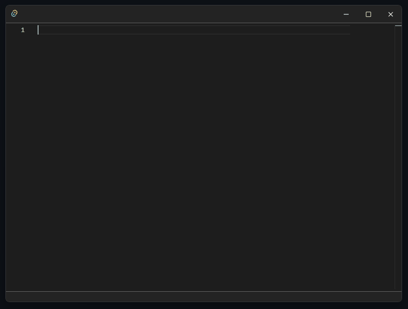

## Monaco + pyright with Tauri 2.0

This project integrates the Monaco Editor and Pyright for real-time Python type checking and IntelliSense-like functionality in a Tauri 2.0 application.



This template is designed to help you quickly start developing an application with [Tauri 2.0](https://tauri.app/) using vanilla HTML, CSS, and JavaScript.

## Recommended IDE Setup

- [VS Code](https://code.visualstudio.com/)
- [Tauri VS Code Extension](https://marketplace.visualstudio.com/items?itemName=tauri-apps.tauri-vscode)
- [rust-analyzer](https://marketplace.visualstudio.com/items?itemName=rust-lang.rust-analyzer)

### Usage

```bash
# Start the development server
cargo tauri dev

# Build the app for production
cargo tauri build
```

### Setting the Virtual Environment Path

To enable Python type checking with Pyright, you need to set the path to your Python virtual environment. This is done in `src/ui/initMonaco.js`.

Find this part in the code:

```javascript
require(["vs/editor/editor.main"], function () {
    let sessionId = null;
    const venvPath = ""; // Set your venv path here, e.g., "C:/Users/you/.virtualenvs/myenv"

    // Additional setup logic...
}
```

Replace the empty string with the actual path to your virtual environment. This path is passed to the Pyright sidecar for accurate type resolution.

---

## Project Structure

```
├── docs/Animation.gif              
├── src/
│   ├── assets/icons/              # Application icons
│   ├── monaco-editor/             # Monaco Editor core files
│   │   ├── min/
│   │   ├── CHANGELOG.md
│   │   ├── LICENSE
│   │   ├── monaco.d.ts
│   │   ├── package.json
│   │   ├── README.md
│   │   └── ThirdPartyNotices.txt
│   ├── ui/
│   │   ├── initMonaco.js          # Monaco + Pyright integration
│   │   └── initTitleBar.js        # Custom title bar logic
│   ├── index.html                 # HTML entry point
│   ├── main.js
│   └── styles.css
├── src-tauri/
│   ├── binaries/
│   │   └── pyright-server-*.exe   # Prebuilt Pyright language server binary
│   ├── capabilities/
│   ├── gen/
│   ├── icons/
│   ├── src/                       # Tauri Rust backend source code
│   └── tauri.conf.json            # Tauri configuration
├── pyright_local/                 # Local Pyright copy (no Node required globally)
│   └── 1.1.398/node_modules/pyright/
│       ├── dist/
│       ├── langserver.index.js
│       ├── index.js
│       └── package.json
├── Cargo.toml
├── Cargo.lock
├── .gitignore
├── LICENSE
└── README.md
```

---

## Notes

- This setup does **not** require Node.js to be installed globally. All required JS dependencies are bundled.
- Make sure your Python virtual environment includes necessary packages and is compatible with Pyright.
- If you experience issues with Pyright resolution, double-check the `venvPath` and ensure Pyright can access it.
- The Python version configured for **Pyright** is **3.12.9** (used for static type analysis, not for installation/runtime).
- For debugging, only **port 1430** is allowed on the host. Ensure any debug-related tools or connections use this port.

---

## ⚠️ Warning: Hot Reload and Unexpected Shutdown

When running in development mode (`cargo tauri dev`), unexpected shutdowns or Hot Reloads may cause issues such as:

- The web server on port 3000 not terminating properly
- Port 1430 access being blocked or conflicting with other services
- Stale Pyright subprocesses or orphaned servers

To avoid these issues:

- Always close the app gracefully using the window close button or `Ctrl+C` in the terminal.
- Manually check and terminate any lingering processes (e.g., web server on port 3000).
- Consider implementing process cleanup logic in Tauri’s backend (Rust) or frontend (JS).